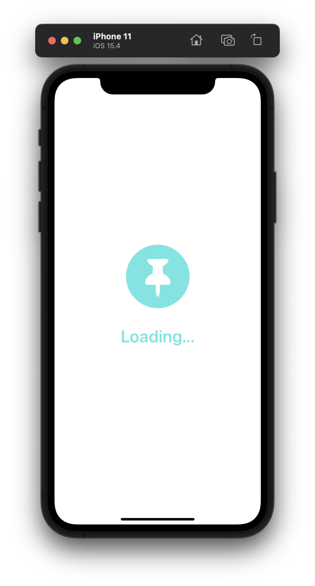
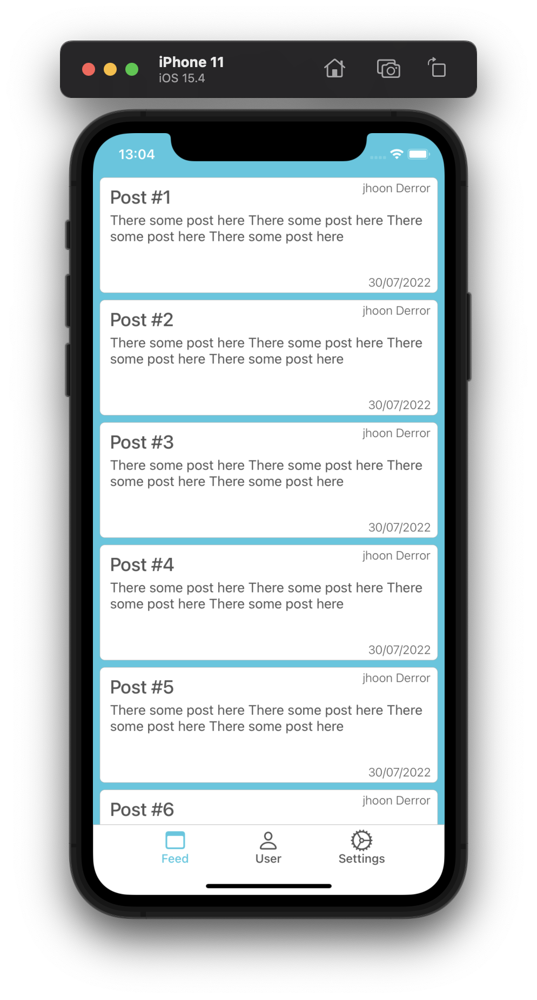
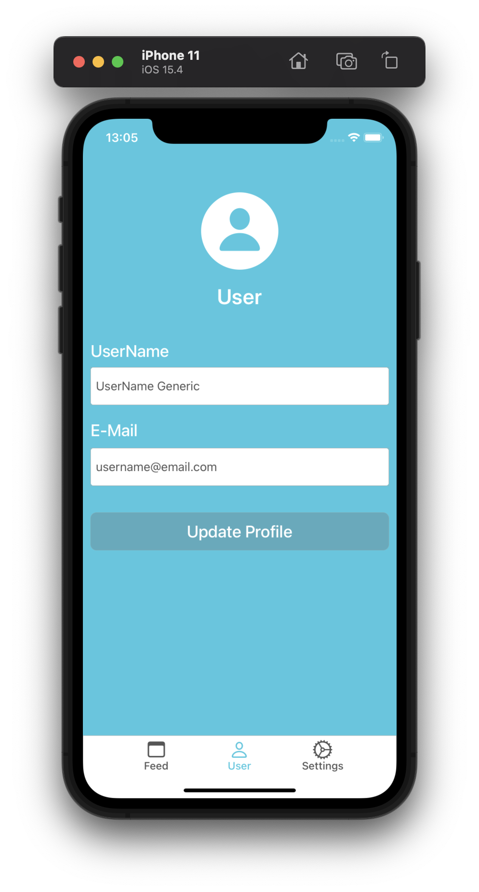
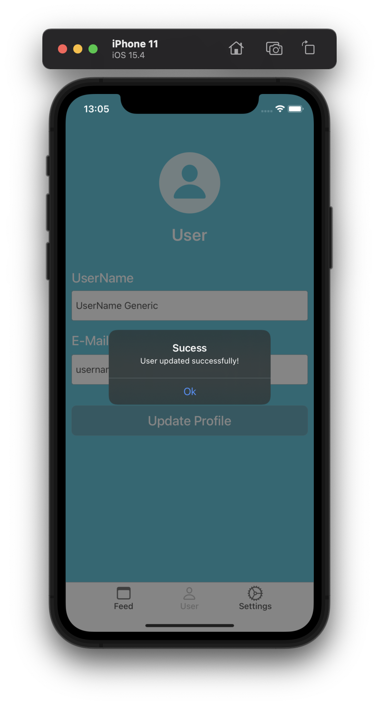
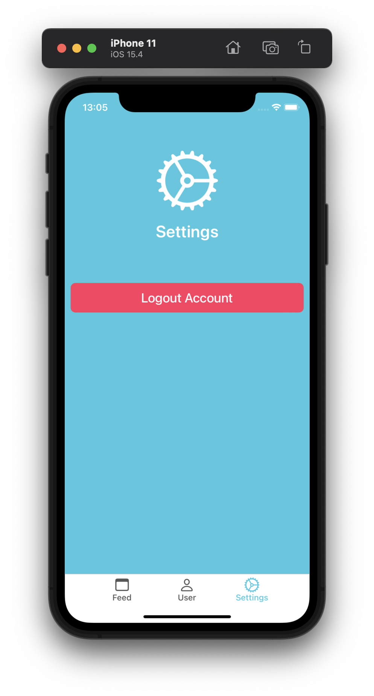
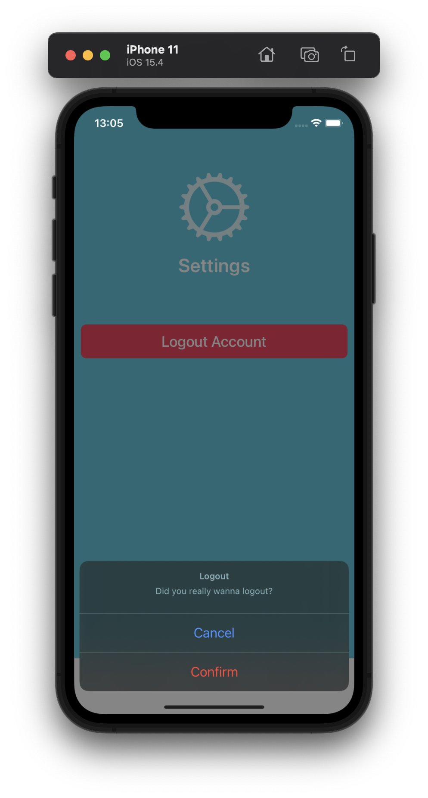

# ViewCodeTabBarApp

A simple App to training UITabBarController

<table>
  <tbody>
   <tr>
      <td></td>
      <td></td>
      <td></td>
    </tr>
    <tr>
      <td></td>
      <td></td>
      <td></td>
    </tr>
  </tbody>
</table>

### Made with ###

- UIKit and ViewCode
- ViewCode ios 13 before support
- UITabBarController
- AutoLayout and Constraints
- Reusable Components: UILabel, UIButton, UITextField
- Protocols
- UITableView and Custom UITableViewCell
- Buttons Delegates
